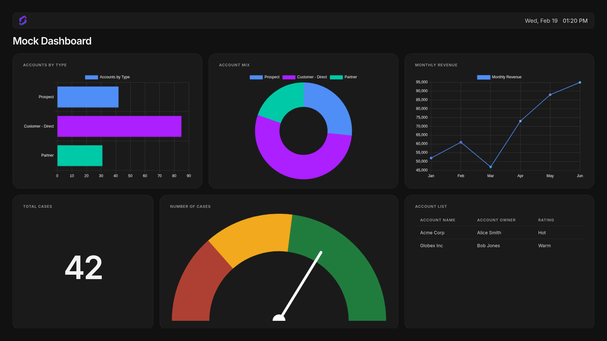

# Salesforce Analytics App

Displays Salesforce dashboards and reports on your Screenly digital signage screens using the Salesforce Reports & Dashboards REST API.



## Prerequisites

- [Bun](https://bun.sh/) 1.2.2+
- [Screenly CLI](https://developer.screenly.io/edge-apps/#getting-started)
- A Salesforce account (a free [Developer Edition](https://www.salesforce.com/products/free-trial/developer/) account works)

## Getting Started

Clone the repository and install dependencies:

```bash
gh repo clone Screenly/salesforce-app -- --recurse-submodules
bun install
```

## Development

```bash
bun run dev
```

This generates a `mock-data.yml` file (gitignored), starts the dev server, and starts a local CORS proxy on `http://127.0.0.1:8080`.

For local development without depending on the Screenly backend, use the [mock-authenticator](mock-authenticator/README.md). It simulates the Screenly OAuth service by running a local Device Flow against Salesforce and serving the resulting tokens to the Edge App.

After `mock-data.yml` is generated, fill in your values under `settings`:

```yaml
settings:
  content_id: '<your Salesforce dashboard or report ID>'
  display_errors: 'false'
  refresh_interval: '300'
  screenly_app_auth_token: mock-token
  screenly_oauth_tokens_url: 'http://localhost:3000/'
```

## Building

```bash
bun run build
```

## Type Checking

```bash
bun run type-check
```

## Linting & Formatting

```bash
bun run lint
bun run format
```

## Testing

```bash
bun test
```

## Screenshots

```bash
bun run screenshots
```

This generates screenshots for all supported resolutions into the `screenshots/` directory using mocked API data. Dashboard screenshots are named `dashboard-<width>x<height>.png`, error screenshots are named `error-<width>x<height>.png`, and report screenshots are named `report-<width>x<height>.png`.

## Deployment

```bash
screenly edge-app create --name salesforce-app --in-place
bun run deploy
screenly edge-app instance create
```

## Configuration

| Setting            | Type   | Required | Description                                                                                           |
| ------------------ | ------ | -------- | ----------------------------------------------------------------------------------------------------- |
| `access_token`     | secret | No       | For testing only. In production, the token is fetched dynamically via the API.                        |
| `content_id`       | string | Yes      | Salesforce dashboard ID or report ID to display                                                       |
| `refresh_interval` | string | No       | How often (in seconds) to refresh Salesforce data. Default: `300`                                     |
| `display_errors`   | string | No       | Display errors on screen for debugging (`true`/`false`). Default: `false`                             |
| `show_labels`      | string | No       | Show data labels on charts and gauges (`true`/`false`). Default: `false`                              |
| `sentry_dsn`       | secret | No       | Sentry DSN for reporting credential and content-load errors. Global setting — leave empty to disable. |

## Authentication

This app uses the Screenly OAuth service to obtain a Salesforce access token at runtime. For local development, the `mock-authenticator` acts as a stand-in for that service.

## Error Reporting

If `sentry_dsn` is set, the app reports credential and content-load failures to Sentry via `@screenly/edge-apps/utils`. Repeated credential-refresh failures (e.g. during the background token-refresh loop) are deduped so only the first consecutive failure is reported, not every retry. Leave `sentry_dsn` empty to disable reporting entirely.

## Finding Your Content ID

Navigate to a dashboard in Salesforce. The Dashboard ID is in the URL:

```
/lightning/r/Dashboard/01ZXX000000XXXXX/view
                        ^^^^^^^^^^^^^^^^
                        This is your Dashboard ID
```

Navigate to a report in Salesforce. The Report ID is in the URL:

```
/lightning/r/Report/00OXX000000XXXXX/view
                     ^^^^^^^^^^^^^^^^
                     This is your Report ID
```

The app infers the content type from the first 3 characters of the ID:

| Prefix | Content Type |
| ------ | ------------ |
| `01Z`  | Dashboard    |
| `00O`  | Report       |

This behavior follows Salesforce's official key-prefix documentation:

- [Salesforce Entity Key Prefix List](https://help.salesforce.com/s/articleView?id=000386286&type=1)

## Supported Visualizations

For dashboards, the app renders components based on the visualization type configured in Salesforce:

| Visualization Type | Rendering            | Notes                                         |
| ------------------ | -------------------- | --------------------------------------------- |
| `Bar`              | Horizontal bar chart | Grouped by report row groupings               |
| `Column`           | Vertical bar chart   | Grouped by report row groupings               |
| `Line`             | Line chart           | Grouped by report row groupings               |
| `Pie`              | Pie chart            | Grouped by report row groupings               |
| `Donut`            | Doughnut chart       | Grouped by report row groupings               |
| `Gauge`            | Gauge chart          | Requires breakpoints configured in Salesforce |
| `FlexTable`        | HTML table           | Tabular reports with detail rows              |

For direct report IDs, the app uses the report response shape to choose a presentation:

- Detail rows present: render as a table
- Grouped aggregate data present: render as a chart
- Single aggregate only: render as a KPI-style value card
